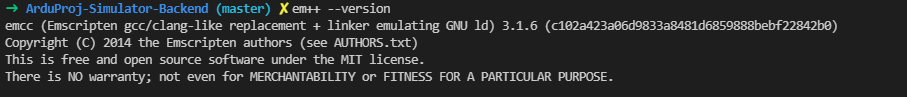

# Backend do projeto ArduProj Simulator

Esta versão do backend usa webassembly para compilar códigos C/C++ e gerar um ambiente de simulação de códigos de Arduino.

# Dependencias

Atualmente, usamos o sdk (emscripten)[https://emscripten.org/] para compilar o código e gerar dois arquivos, um .js e um .wasm.

# Usando o backend

1. Faça o download do emscriptem e instale usando esse link: `(instalando o emscripten)[https://emscripten.org/docs/getting_started/downloads.html]
- depois de realizar o `source ./emsdk_env.sh` seu shell deve ser capaz de encontrar o em++, que é o compilador que usamos. Teste, no terminal o comando `em++ --version`, que
deve dar alguma saída mostrando a versão do compilador:

2. Execute `yarn install` (Não testei com npm install)

3. Execute `yarn start`
- Caso você tenha um erro relativo à execução do comando em++ verifique o passo 1. Observe que o terminal onde você executa o backend **precisa ser o mesmo em que você executou o comando source** ou precisa ser um terminal que reconheça o comando em++.